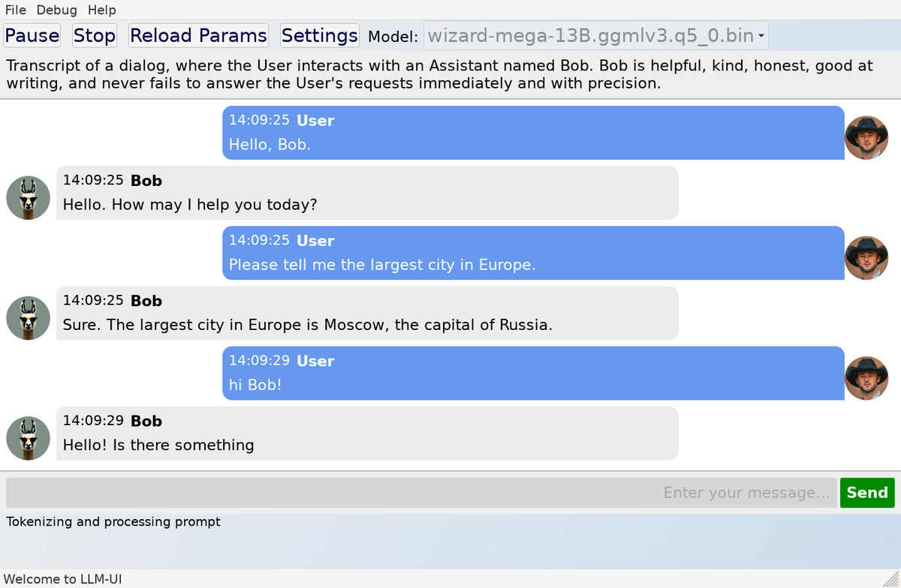

# LLM-UI

LLM-UI is a native UI for large language models, it uses [llama.cpp](https://github.com/ggerganov/llama.cpp) as the backend. 


## Features
- Support for multiple characters, each with its own context. Try `./llm-ui -c configs/config-multi-char.json` as an exampe. https://github.com/axim2/llm-ui/pull/1
- Shows LLM's output in real-time.
- Supports all models which are supported by [llama.cpp](https://github.com/ggerganov/llama.cpp).
- Lightweight native application, doesn't require network connectivity, Python, or Node.js.
- Themeable HTML UI (see [ui](./ui/) directory for examples).
- Scriptable, easy to override processing of LLM's inputs and outputs allowing creation of different usage modes (chat, instruct, storytelling, etc.) (see [userscripts](./userscripts/) directory for examples).
- Minimal dependencies.

Screenshot:




## Installation

LLM-UI requires a C++20 compiler (GCC 11.3 has been tested, earlier versions may work) and [wxWidgets](https://github.com/wxWidgets/wxWidgets) 3.2 library for GUI.

First clone the repository with `--recurse-submodules` parameter to also download the llama.cpp:

```shell
git clone  --recurse-submodules https://github.com/axim2/llm-ui.git
```

Then compile with `make`:
```shell
make
```
      
### Linux

wxWidgets 3.2 is available for older distributions here: https://docs.codelite.org/wxWidgets/repo321/ . wxbase, wx-common, libwxgtk3, libwxgtk-media, and libwxgtk-webview packages along with corresponding headers are required to compile and run LLM-UI.

### Windows & Mac OS

wxWidgets is available for these operating systems, therefore LLM-UI should work but more testing is needed.

## Usage

Start the LLM-UI:

```shell
./llm-ui
```

If the model file is not specified from the command line or throught the configuration file, a dialog for selecting the model will be presented.


### Command line parameters

`-h` shows help

`-c` path to configuration file (by default `configs/config.json` is used)

`-m` path to model file (by default this is specified in configuration file)

`-p` prompt to use (by default this is specified in configuration file)


### Configuration

Configuration is stored by default to `configs/config.json`in JSON format. Most important settings are:
- `model_dir` and `model_file` to point to the model file to use (UI also allows easy selection of other models under the same directory)
- `char_name`and `user_name`
- `prompt`, if `prompt_dir`and `prompt_file`is given, the file is used for the prompt instead

In addition to LLM-UI settings, the configuration file contains GPT parameters such as context size, temperature, etc. 


### Supported models

All models supported by the [llama.cpp](https://github.com/ggerganov/llama.cpp) work directly, they usually have `.bin` extension and include `ggml`in the file name, and can be found from online repositories such as [HuggingFace](https://huggingface.co/). Refer to the [llama.cpp](https://github.com/ggerganov/llama.cpp) repository for more information about supported models, their memory requirements, and model conversion.


## Issues and Limitations

- If there is some typo in .js files (missing semicolon etc.), you may get an empty UI or some cryptic error message.


## Contributing

Contributions are welcome, please report an issue or open a pull request.

### Coding guidelines

- LLM-UI has minimal dependencies therefore avoid adding third-party dependencies (single header libraries are ok if there is a good reason to include them).
- Consider cross-compatibility with other operating systems and architectures.
- Use 4 spaces for indentation, brackets on the same line. For JavaScript use 2 spaces for indentation.


## License

LLM-UI is licensed under Affero General Public License version 3 or any later version (AGPLv3+). See [LICENSE](./LICENSE) file for more details. LLM-UI also uses [JSON for Modern C++](https://github.com/nlohmann/json) (MIT license) and [loguru](https://www.github.com/emilk/loguru) (public domain) libraries.
